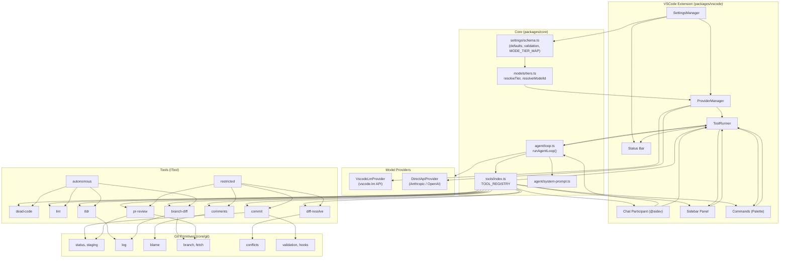
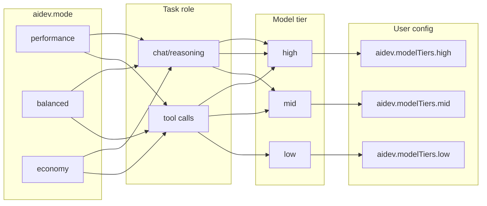

# AIDev — Feature & Architecture Diagram

How the main features and layers relate. See `SPEC.md` for full detail.



## Agent loop flow (free-form chat)

```mermaid
sequenceDiagram
  participant User
  participant Chat as Chat Participant
  participant Loop as runAgentLoop()
  participant Provider as IModelProvider
  participant Runner as ToolRunner

  User->>Chat: Free-form message
  Chat->>Loop: runAgentLoop(provider, config, history, msg)
  Loop->>Loop: buildSystemPrompt(config)
  Loop->>Provider: sendRequest(messages, tools)

  alt tool_call (autonomous)
    Provider-->>Loop: toolCalls[]
    Loop-->>Chat: yield tool_call
    Chat->>Runner: execute(toolId, args)
    Runner-->>Chat: ScanResult
    Chat->>Loop: next(toolResult)
    Loop->>Provider: sendRequest(..., toolResult)
  else confirmation_required (restricted)
    Provider-->>Loop: toolCalls[]
    Loop-->>Chat: yield confirmation_required
    Chat->>User: Confirm?
    User->>Chat: Yes/No
    Chat->>Runner: execute(...) or skip
    Chat->>Loop: next(toolResult)
  else response
    Provider-->>Loop: content, stopReason=end_turn
    Loop-->>Chat: yield response
    Chat->>User: Stream text
  else error
    Loop-->>Chat: yield error
    Chat->>User: Show error
  end
```

## Mode → tier → model



## Tool ↔ UI surface

| Tool          | Invocation   | Chat slash | Sidebar category | Uses Git              |
|---------------|-------------|------------|-------------------|------------------------|
| dead-code     | autonomous  | /deadcode  | Hygiene           | —                      |
| lint          | autonomous  | /lint      | Hygiene           | —                      |
| comments      | restricted  | /comments  | Hygiene           | blame                  |
| commit        | restricted  | /commit    | SCM               | status, staging, hooks |
| tldr          | autonomous  | /tldr      | General           | log                    |
| branch-diff   | autonomous  | /branchdiff| SCM               | branch, log            |
| diff-resolve  | restricted  | /resolve   | SCM               | conflicts              |
| pr-review     | restricted  | /prreview  | (sidebar)         | branch, status         |
