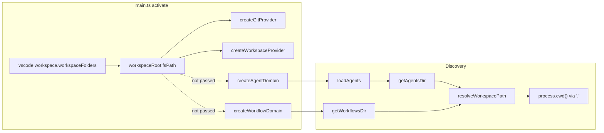

# Debug Audit: Agents, Workflows, and Chat

This document captures a code audit for two issues: (1) agents and workflows not found in the debug IDE, and (2) chat auto-returning git-based JSON instead of processing input. It includes further inspection of the implementation, references to `docs/VENDOR_REFERENCE.md`, and explicit cited remediations.

---

## Summary

**Issue 1 — No agents/workflows in debug IDE:** The sidebar shows "No agents found" and "No workflows found" because agent and workflow discovery never receive the workspace root. They resolve `.vscode/agents` and `.vscode/workflows` relative to `"."` (i.e. `process.cwd()`). In the Extension Development Host, `process.cwd()` is not guaranteed to be the opened project folder, so discovery looks in the wrong place and finds nothing.

**Issue 2 — Chat returns git/JSON and doesn't process:** Any message that doesn't start with a known slash command (`/status`, `/scan`, `/workflows`, `/agents`, `/context`) defaults to `chat.context`, which only gathers git status and active file and returns that as a raw JSON blob. There is no path that "processes" free-form text (no intent parsing, no "run workflow X"), so the observed behavior is by design—but it contradicts the expected tool/agent chat UX.

---

## Issue 1: Agents/workflows not found in debug IDE

### Root cause

Workspace root is never passed into agent or workflow discovery.

- In `src/main.ts`, the workspace root is taken from VS Code and passed only to git and workspace:
  - `workspaceRoot = vscode.workspace.workspaceFolders?.[0]?.uri.fsPath ?? process.cwd()`
  - It is passed into `createGitProvider(workspaceRoot)` and `createWorkspaceProvider(workspaceRoot)`.
- Agent and workflow domains are created with no workspace root:
  - `createAgentDomain(logger)` and `createWorkflowDomain(logger, stepRunner)` — no `workspaceRoot` argument.
- Discovery then uses a default of `"."`:
  - `src/infrastructure/workspace.ts`: `resolveWorkspacePath(..., workspaceRoot)` uses `workspaceRoot ?? "."` when `workspaceRoot` is undefined.
  - `loadAgents(workspaceRoot?)` and workflow discovery call `getAgentsDir(workspaceRoot)` / `getWorkflowsDir(workspaceRoot)` with no argument, so they resolve `.vscode/agents` and `.vscode/workflows` relative to `"."`.
  - In Node, `"."` is resolved as `process.cwd()`, so discovery always runs relative to the **process current working directory**, not the VS Code workspace root.

### Why the UI shows "no agent/workflow found"

- The tree providers call `agent.list` / `workflow.list`, which call `discoverAgents()` / `discoverWorkflows()` with no parameters. Those never see `CommandContext` or `ctx.workspaceFolders`.
- So the discovery path is always `path.join(".", ".vscode/agents")` → `".vscode/agents"` (and similarly for workflows), i.e. relative to **process.cwd()**.
- In the Extension Development Host, `process.cwd()` is not guaranteed to be the folder where `.vscode/agents` and `.vscode/workflows` live. If cwd is not the project root, `listJsonFiles()` either hits a missing directory (catch in `workspace.ts` line 68) or reads a different `.vscode` and returns no valid definitions, so the tree shows "No agents found" / "No workflows found".

### Relevant code

- `src/main.ts` (121–127): `workspaceRoot` is computed and passed only to git and workspace; agent/workflow domains are not given any root.
- `src/infrastructure/workspace.ts` (36–41, 46–55): `resolveWorkspacePath(..., workspaceRoot)` with `workspaceRoot ?? "."`; `getAgentsDir` / `getWorkflowsDir` use that.
- `src/infrastructure/agent-registry.ts` (54–56): `loadAgents(workspaceRoot?)` → `getAgentsDir(workspaceRoot)`; callers (e.g. `AgentDomainService.discoverAgents()`) call `loadAgents()` with no args.
- `src/domains/agent/service.ts` (80–83): `discoverAgents()` calls `loadAgents()` with no arguments; no use of `workspaceFolders` or context.
- `src/domains/workflow/service.ts` (99–103): `discoverWorkflows()` uses `getWorkflowsDir()` with no arguments; same pattern.

---

## Issue 2: Chat returns git/JSON and doesn't process

### How chat is wired

- In `src/ui/chat-participant.ts`, the handler takes the first word of the user message and maps it to a command via `SLASH_MAP`. Only these first words are treated as commands: `/status`, `/scan`, `/workflows`, `/agents`, `/context`.
- Any other text (e.g. "run lint", "what can you do?") does not match a slash command, so `SLASH_MAP[firstWord]` is undefined and the fallback is **`"chat.context"`** (line 28).
- So **all free-form input runs `chat.context`**, not an LLM and not a generic "process my request" path.

### What chat.context does

- In `src/domains/chat/handlers.ts`, `createContextHandler` only:
  - Calls `gitProvider.status()`
  - Builds a `ChatContext`: `{ activeFile, gitBranch, gitStatus }`
  - Returns that object as the command result.
- The chat participant then, on success, streams that result as JSON (lines 38–39 of `chat-participant.ts`): `stream.markdown("```json\n" + json + "\n```")`.

So whenever the user doesn't start with a known slash command, the only thing that runs is **git status + active file**, and the only thing they see is **that context object as JSON**. There is no path that "processes" or "answers" free-form questions.

### Contributing detail

- `chat.delegate` exists for running a workflow by name, but it is only invoked when something explicitly dispatches a command with `name: "chat.delegate"` and `params: { task, workflow }`. The chat participant does not map any user input to `chat.delegate`; it only maps the fixed slash commands and otherwise defaults to `chat.context`. So from the user's perspective, chat is "git context + JSON," with no delegation or workflow run unless another code path calls `chat.delegate`.

---

## Further inspection

### Workspace root flow

The following diagram shows how `workspaceRoot` is computed in `main.ts` and passed only to git and workspace providers; agent and workflow domains never receive it, so discovery uses `"."` and thus `process.cwd()`.



- **main.ts (121–127)**: `workspaceRoot` is computed from `vscode.workspace.workspaceFolders?.[0]?.uri.fsPath ?? process.cwd()` and passed only to `createGitProvider` and `createWorkspaceProvider`. `createAgentDomain(logger)` and `createWorkflowDomain(logger, stepRunner)` are called with no workspace argument.
- **VENDOR_REFERENCE.md**: Documents `vscode.workspace` for "Workspace (folders, files, configuration)" and that workspace methods are the source of truth; using the first workspace folder's path for "project root" is the intended pattern.
- **agent-registry.ts (54–56)**: `loadAgents(workspaceRoot?: string)` calls `getAgentsDir(workspaceRoot)`; when called with no args from `AgentDomainService.discoverAgents()` (agent/service.ts 81), `workspaceRoot` is undefined.
- **workspace.ts (36–41, 46–55)**: `resolveWorkspacePath(relativePath, workspaceRoot)` uses `workspaceRoot ?? "."`, so undefined yields a path relative to `process.cwd()`. `getAgentsDir` / `getWorkflowsDir` use that.
- **workflow/service.ts (101–105)**: `discoverWorkflows()` calls `getWorkflowsDir()` with no arguments (the workflow service does not have a `workspaceRoot` parameter in its API).

**Conclusion:** Discovery is implemented to accept an optional workspace root, but the extension never supplies it to the agent or workflow domain, so behavior depends on `process.cwd()` and breaks in the debug IDE when cwd ≠ project root.

### Chat flow and expected UX

- **chat-participant.ts (26–43)**: Request handler takes `request.prompt`, splits on first word, and uses `SLASH_MAP[firstWord] ?? "chat.context"`. Only exact slash tokens are mapped; everything else runs `chat.context`, which returns a single JSON blob. Success branch always streams raw `JSON.stringify(result.value, null, 2)` in a markdown code block—no per-command formatting or hints.
- **VENDOR_REFERENCE.md**: Best practices include "Provide clear, actionable error messages" and "Avoid modal dialogs for common operations"; chat should feel like a tool surface (list capabilities, run named actions) rather than a single opaque JSON response.
- **ROADMAP.md (88, 180–198)**: Describes mapping `chat.context` to session setup, `chat.delegate` to participant tools, and "run workflow X" as a tool call; "Registers 2–3 tools" and "run workflow X" imply run-by-name from chat.
- **result-handler.ts (44–76)**: Already has human-readable `formatResultMessage` per command (e.g. git status one-liner, workflow/agent count). Chat does not use this; it always dumps JSON.

**Conclusion:** Chat is implemented as "slash → one command → raw JSON or error." There is no "run &lt;workflow&gt;" parsing, no use of the existing result formatter for chat, and no summary/hints when defaulting to context, which contradicts the intended tool/agent UX and ROADMAP.

---

## Reference: VENDOR_REFERENCE.md

Workspace root and UX guidance in this audit are aligned with `docs/VENDOR_REFERENCE.md`:

- **Workspace API**: `vscode.workspace` — "Workspace (folders, files, configuration)". Using the first workspace folder's path as project root is the intended pattern for file-based discovery.
- **Best practices**: "Provide clear, actionable error messages"; "Avoid modal dialogs for common operations"; "Use progress reporting for long-running tasks"; "Respect user settings and configuration."
- **Command registration**: Commands are registered via `vscode.commands.registerCommand()`; chat participant exposes a subset of capabilities and should present them in a clear, actionable way.

See `docs/VENDOR_REFERENCE.md` for the full vendor reference.

---

## Cited remediations

### 3.1 Fix discovery in debug IDE (root cause)

**Goal:** Agent and workflow discovery use the same workspace root as the rest of the extension (from `vscode.workspace.workspaceFolders`), per VENDOR_REFERENCE.

| # | File | Current code / location | Change |
|---|------|-------------------------|--------|
| R1 | `src/main.ts` | Lines 123–124, 154–155: `workspaceRoot` not passed to agent/workflow domains. | Pass `workspaceRoot` into factory calls: `createWorkflowDomain(logger, stepRunner, workspaceRoot)` and `createAgentDomain(logger, workspaceRoot)`. |
| R2 | `src/domains/agent/service.ts` | Constructor (29) takes only `logger`; `discoverAgents()` (80–82) calls `loadAgents()` with no args. | Add optional `workspaceRoot?: string` to constructor; store as `private workspaceRoot?: string`. In `discoverAgents()`, call `loadAgents(this.workspaceRoot)`. Update factory `createAgentDomain(logger, workspaceRoot?)` to pass it through. |
| R3 | `src/domains/agent/service.ts` | `createListAgentsHandler(this.logger, () => this.discoverAgents())` (34–36). | No signature change needed; `discoverAgents()` will use instance `workspaceRoot` after R2. |
| R4 | `src/domains/workflow/service.ts` | Constructor (42) and `discoverWorkflows()` (101–105): no workspace root; `getWorkflowsDir()` called with no args. | Add optional `workspaceRoot?: string` to constructor; store as `private workspaceRoot?: string`. In `discoverWorkflows()`, call `getWorkflowsDir(this.workspaceRoot)`. Update factory `createWorkflowDomain(logger, stepRunner?, workspaceRoot?)` to accept and pass it. |
| R5 | `src/infrastructure/workspace.ts` | No change. | Already supports `getAgentsDir(workspaceRoot?)` and `getWorkflowsDir(workspaceRoot?)`; `resolveWorkspacePath(_, workspaceRoot)` uses `workspaceRoot ?? "."`. |

**Sourcing:** VENDOR_REFERENCE.md "vscode.workspace — Workspace (folders, files, configuration)"; main.ts already uses `vscode.workspace.workspaceFolders?.[0]?.uri.fsPath` for git/workspace—reuse that same value for agent and workflow discovery.

### 3.2 Chat UX (contributing factors + "expected" experience)

**Goal:** Chat behaves like a tool/agent surface: context is summarized readably; user can run workflows by name; responses use existing human-readable messages where applicable (per VENDOR_REFERENCE "clear, actionable" and ROADMAP "run workflow X").

| # | File | Current code / location | Change |
|---|------|-------------------------|--------|
| C1 | `src/ui/chat-participant.ts` | Lines 26–31: Only `SLASH_MAP[firstWord]`; no "run &lt;name&gt;" handling. | After trimming, if first word is `run` (case-insensitive) and rest is non-empty, treat as workflow run: set command to `workflow.run` and params to `{ name: rest.trim() }`. Otherwise keep existing slash/context mapping. |
| C2 | `src/ui/chat-participant.ts` | Lines 37–42: On success, always stream raw JSON. | Branch by `commandName`: for `chat.context`, format a short readable summary (e.g. branch, dirty/clean, active file) and append a line like "Available: /status, /scan, /workflows, /agents. To run a workflow: say **run &lt;name&gt;**." For other commands, use `formatResultMessage(commandName, result)` from `result-handler.ts` and stream that message (and optionally still include a compact JSON snippet for list commands like workflow.list/agent.list). Avoid dumping full raw JSON as the only response for context. |
| C3 | `src/infrastructure/result-handler.ts` | Used by OutputChannel/notifications only. | No change required; chat participant will call `formatResultMessage` for chat stream (see C2). Optionally add a `chat.context` branch that returns a one-line summary (e.g. "Branch X, clean. Active file: Y.") if not already sufficient. |

**Sourcing:** VENDOR_REFERENCE.md "Provide clear, actionable error messages"; ROADMAP.md "run workflow X" and "Registers 2–3 tools"; existing `formatResultMessage` in result-handler.ts for consistent, human-readable output.

### Implementation notes (adjustments)

- **Factory parameter order**: Add `workspaceRoot` as the third argument to `createWorkflowDomain(logger, stepRunner, workspaceRoot)`; keep it optional so existing call sites (e.g. tests) still work. For agent, `createAgentDomain(logger, workspaceRoot?)` — second param optional.
- **Multi-root workspace**: Remediations use `workspaceFolders?.[0]` only. First workspace folder is the scope; multi-root support is out of scope and can be a separate change.
- **C1 edge case**: Workflow name is the rest of the message after "run". For names with spaces (e.g. "run lint and commit"), the whole rest is passed as one name; user should say "run lint-and-commit" for a workflow named `lint-and-commit`.
- **C2 and result-handler**: `formatResultMessage(commandName, result)` returns `{ level, message }`. In chat, stream `formatResultMessage(..., result).message`.

---

## Summary table

| Issue | Root cause | Contributing factor |
|-------|------------|---------------------|
| No agents/workflows in debug IDE | Agent/workflow discovery never receive workspace root; they use `"."` → `process.cwd()` for `.vscode/agents` and `.vscode/workflows`. | In Extension Development Host, `process.cwd()` may not be the project folder, so discovery finds no (or wrong) files. |
| Chat returns git/JSON and doesn't "process" | Default command for any non-slash input is `chat.context`, which only returns git + active file as JSON. | No free-form "process user message" path (no LLM, no mapping of intent to commands or `chat.delegate`). |

---

## Review and validation (post-fix)

Use this section to verify behavior and critique the applied logic after implementing R1–R5 and C1–C3.

### Discovery (R1–R5)

- **R1**: In `main.ts`, `workspaceRoot` is passed into both `createWorkflowDomain(logger, stepRunner, workspaceRoot)` and `createAgentDomain(logger, workspaceRoot)`. When `workspaceFolders` is empty, `workspaceRoot` remains `process.cwd()` (existing fallback).
- **R2/R4**: Agent and workflow services accept optional `workspaceRoot` and pass it into `loadAgents(this.workspaceRoot)` and `getWorkflowsDir(this.workspaceRoot)`. When `workspaceRoot` is undefined (e.g. tests), `resolveWorkspacePath` still uses `"."` so behavior is unchanged for callers that don't pass root.
- **Validation**: In Extension Development Host with the project folder open, the Agents and Workflows sidebar views show the definitions from `.vscode/agents/` and `.vscode/workflows/` (no longer "No agents/workflows found"). No regression when no folder is open (discovery still runs relative to cwd).
- **Critique**: Single-workspace only; discovery is synchronous (no async workspace API). Acceptable for current scope.

### Chat UX (C1–C3)

- **C1**: Input like "run sync-repo" or "Run lint-and-commit" dispatches `workflow.run` with `name: "sync-repo"` / `"lint-and-commit"`. Slash commands and "run" are mutually exclusive (first-word wins). No conflict with `/status`, `/scan`, etc.
- **C2**: `chat.context` response is a short summary (branch, dirty/clean, active file) plus the hints line; it is no longer a single raw JSON block. Other commands use `formatResultMessage` so chat output matches the existing human-readable messages used in OutputChannel/notifications.
- **C3**: Optional; if the existing `formatResultMessage` branch for `chat.context` ("Chat context gathered.") is too terse, add a dedicated summary (e.g. "Branch X, clean. Active file: Y.") in result-handler.
- **Validation**: In chat, "run sync-repo" runs the workflow and shows the workflow result message. Free-form text (e.g. "hello") shows context summary + "Available: /status ..." and "To run a workflow: say **run &lt;name&gt;**." List commands (/workflows, /agents) can show both the formatted message and a compact listing.
- **Critique**: "run" is a reserved first word; natural language like "can you run sync-repo" still falls back to context (first word "can"). Extending to more intents would require broader parsing or an LLM; out of scope for this remediation.

### Regression and consistency

- Git and workspace providers already use `workspaceRoot` from main; after R1–R4, agent and workflow discovery use the same source. One source of truth, no new APIs.
- Chat reuses `formatResultMessage` instead of duplicating formatting logic; notifications and chat stay consistent.
